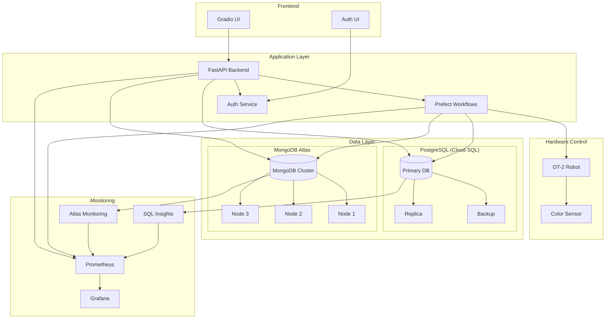
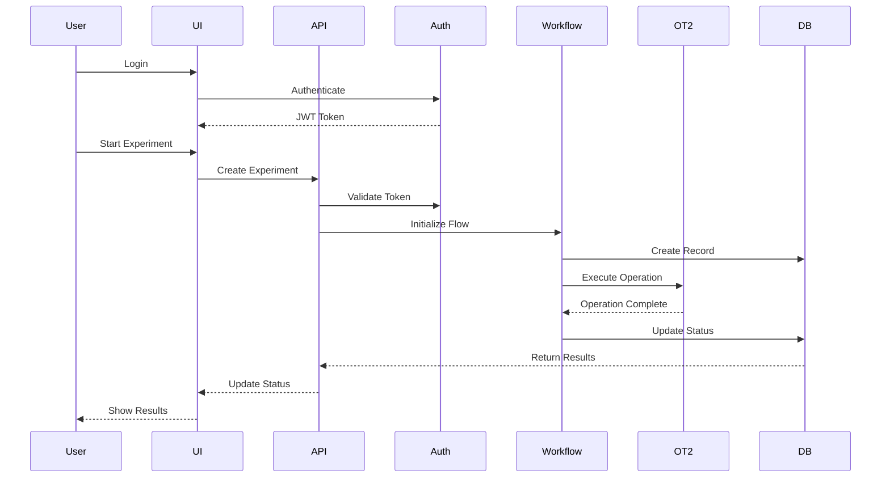
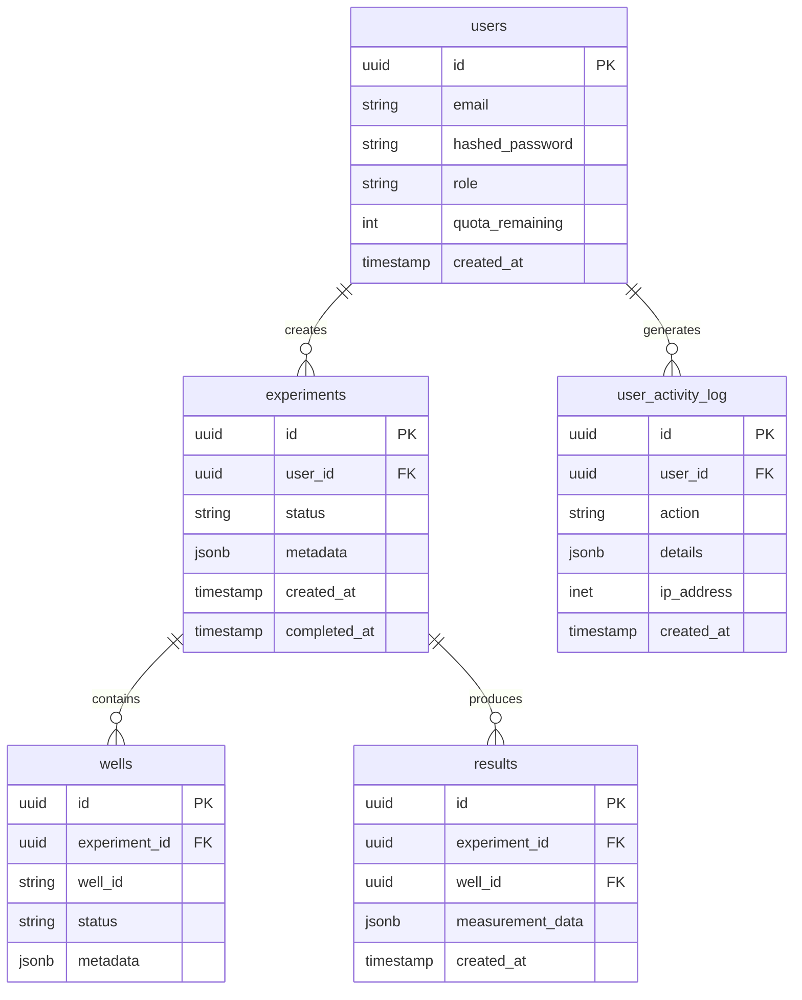
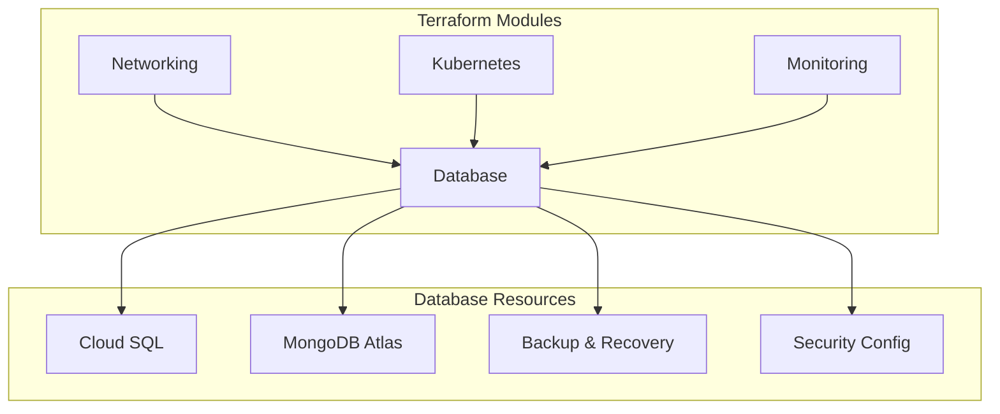

# System Architecture

## High-Level Architecture

```mermaid
graph TB
    subgraph "Frontend"
        UI[Gradio UI]
        Auth[Auth UI]
    end

    subgraph "Application Layer"
        API[FastAPI Backend]
        WF[Prefect Workflows]
        Auth_Svc[Auth Service]
    end

    subgraph "Data Layer"
        subgraph "PostgreSQL (Cloud SQL)"
            PG[(Primary DB)]
            PG_Backup[Backup]
            PG_Replica[Replica]
        end
        
        subgraph "MongoDB Atlas"
            MG[(MongoDB Cluster)]
            MG_Node1[Node 1]
            MG_Node2[Node 2]
            MG_Node3[Node 3]
        end
    end

    subgraph "Hardware Control"
        OT2[OT-2 Robot]
        Sensor[Color Sensor]
    end

    subgraph "Monitoring"
        Prom[Prometheus]
        Graf[Grafana]
        SQL_Monitor[SQL Insights]
        Atlas_Monitor[Atlas Monitoring]
    end

    UI --> API
    Auth --> Auth_Svc
    API --> WF
    API --> Auth_Svc
    WF --> OT2
    OT2 --> Sensor
    WF --> PG
    WF --> MG
    API --> PG
    API --> MG
    
    PG --> PG_Backup
    PG --> PG_Replica
    MG --> MG_Node1
    MG --> MG_Node2
    MG --> MG_Node3
    
    PG --> SQL_Monitor
    MG --> Atlas_Monitor
    SQL_Monitor --> Prom
    Atlas_Monitor --> Prom
    API --> Prom
    WF --> Prom
    Prom --> Graf
```

## Data Flow

```mermaid
sequenceDiagram
    participant User
    participant UI
    participant API
    participant Auth
    participant Workflow
    participant OT2
    participant DB

    User->>UI: Login
    UI->>Auth: Authenticate
    Auth-->>UI: JWT Token
    
    User->>UI: Start Experiment
    UI->>API: Create Experiment
    API->>Auth: Validate Token
    API->>Workflow: Initialize Flow
    
    Workflow->>DB: Create Record
    Workflow->>OT2: Execute Operation
    OT2-->>Workflow: Operation Complete
    Workflow->>DB: Update Status
    
    DB-->>API: Return Results
    API-->>UI: Update Status
    UI-->>User: Show Results
```

## Database Schema

```mermaid
erDiagram
    users ||--o{ experiments : creates
    experiments ||--o{ wells : contains
    experiments ||--o{ results : produces
    users ||--o{ user_activity_log : generates

    users {
        uuid id PK
        string email
        string hashed_password
        string role
        int quota_remaining
        timestamp created_at
    }

    experiments {
        uuid id PK
        uuid user_id FK
        string status
        jsonb metadata
        timestamp created_at
        timestamp completed_at
    }

    wells {
        uuid id PK
        uuid experiment_id FK
        string well_id
        string status
        jsonb metadata
    }

    results {
        uuid id PK
        uuid experiment_id FK
        uuid well_id FK
        jsonb measurement_data
        timestamp created_at
    }

    user_activity_log {
        uuid id PK
        uuid user_id FK
        string action
        jsonb details
        inet ip_address
        timestamp created_at
    }
```

## Infrastructure as Code

```mermaid
graph TB
    subgraph "Terraform Modules"
        Net[Networking]
        DB[Database]
        K8s[Kubernetes]
        Mon[Monitoring]
    end

    subgraph "Database Resources"
        SQL[Cloud SQL]
        Atlas[MongoDB Atlas]
        Backup[Backup & Recovery]
        Security[Security Config]
    end

    DB --> SQL
    DB --> Atlas
    DB --> Backup
    DB --> Security
    Net --> DB
    K8s --> DB
    Mon --> DB
``` 