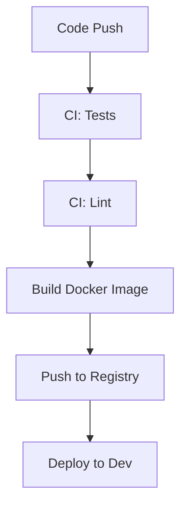
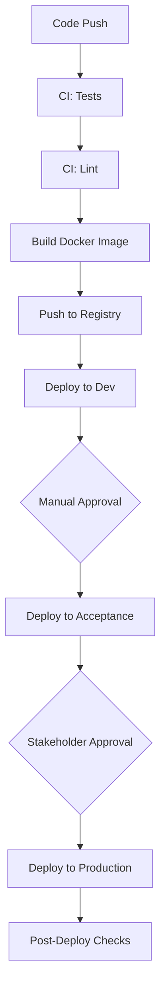

# Deployment Pipeline

## Current State (Development Only)



## Proposed Complete Pipeline

### 1. Environment Stages

#### 1.1 Development (Current)
- Automatic deployment on main branch
- Basic testing and validation
- Development configuration
- Accessible to developers only

#### 1.2 Acceptance/Staging (To Be Implemented)
- Manual approval required
- Full integration testing
- Production-like configuration
- Limited access for QA and stakeholders
- Data anonymization required

#### 1.3 Production (To Be Implemented)
- Strict approval process
- Performance monitoring
- High availability setup
- Restricted access
- Full security measures

### 2. Deployment Process



### 3. Implementation Plan

#### 3.1 Acceptance Environment Setup
```yaml
# .github/workflows/deploy-acceptance.yml
name: Deploy to Acceptance
on:
  workflow_dispatch:
    inputs:
      version:
        description: 'Version to deploy'
        required: true

jobs:
  deploy:
    runs-on: ubuntu-latest
    environment: acceptance
    steps:
      - name: Deploy to Acceptance
        # Deployment steps
      - name: Run Integration Tests
        # Test steps
      - name: Notify Stakeholders
        # Notification steps
```

#### 3.2 Production Environment Setup
```yaml
# .github/workflows/deploy-production.yml
name: Deploy to Production
on:
  workflow_dispatch:
    inputs:
      version:
        description: 'Version to deploy'
        required: true

jobs:
  deploy:
    runs-on: ubuntu-latest
    environment: production
    steps:
      - name: Pre-deployment Checks
        # Safety checks
      - name: Deploy to Production
        # Deployment steps
      - name: Post-deployment Verification
        # Verification steps
      - name: Monitor Metrics
        # Monitoring steps
```

### 4. Environment Configurations

#### 4.1 Development
- Resource limits: moderate
- Debug logging: enabled
- Feature flags: all enabled
- Monitoring: basic

#### 4.2 Acceptance
- Resource limits: production-like
- Debug logging: minimal
- Feature flags: selective
- Monitoring: full
- Data: anonymized production data

#### 4.3 Production
- Resource limits: full
- Debug logging: disabled
- Feature flags: controlled
- Monitoring: comprehensive
- Data: real production data

### 5. Security Measures

#### 5.1 Access Control
- Development: team access
- Acceptance: limited stakeholder access
- Production: restricted access

#### 5.2 Deployment Approvals
- Development: automatic
- Acceptance: team lead approval
- Production: multiple approvals required

### 6. Rollback Procedures

#### 6.1 Automatic Rollback Triggers
- Error rate threshold exceeded
- Performance degradation
- Critical security alerts

#### 6.2 Manual Rollback Process
```bash
# Rollback script example
./scripts/rollback.sh [environment] [version]
```

### 7. Monitoring and Alerts

#### 7.1 Metrics to Monitor
- Application health
- Database performance
- API response times
- Error rates
- Resource utilization

#### 7.2 Alert Configurations
- Development: team notifications
- Acceptance: team + stakeholder notifications
- Production: full escalation path

### 8. Next Steps

1. Set up Acceptance environment
   - Infrastructure provisioning
   - Configuration management
   - Access control implementation

2. Implement Production pipeline
   - Approval workflows
   - Security measures
   - Monitoring setup

3. Create documentation
   - Deployment procedures
   - Rollback processes
   - Emergency protocols 